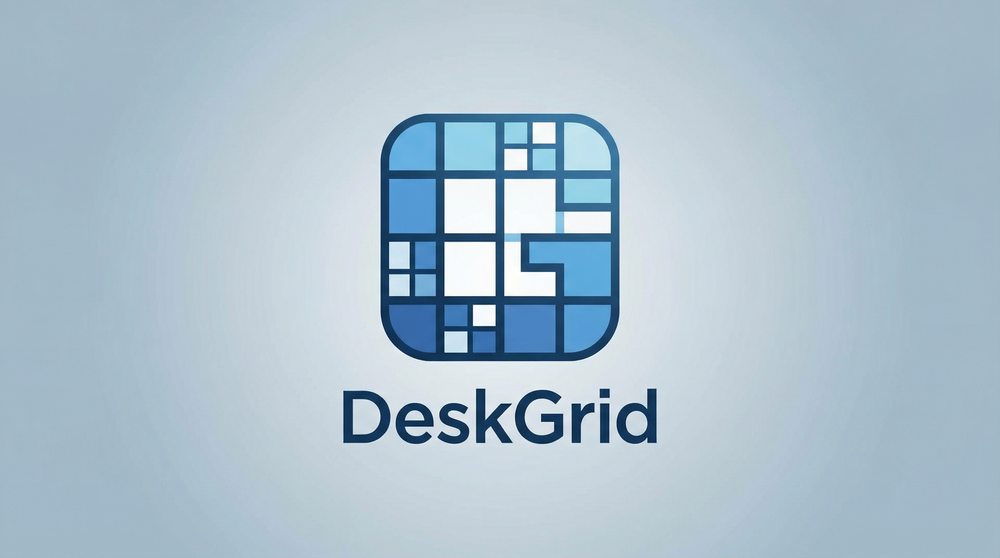

# DeskGrid

**Desktop organization for Windows** — Create customizable portals on your desktop to organize files, apps, and bookmarks.

---

## ⚠️ Early Test Version

> **WARNING: This is an early test release with known bugs. Use at your own risk!**
>
> This version is provided for testing and feedback purposes only. 
---

## ✨ Features

- **Folder Portals** — Create desktop containers that display folder contents with drag-and-drop support
- **App Portals** — Embed running applications directly on your desktop
- **URL Portals** — Quick access bookmarks panel for your favorite websites
- **Desktop Integration** — Portals live on your desktop, behind regular windows but above wallpaper
- **Visual Customization** — Change header colors, background colors, and title alignment
- **Roll-up/Expand** — Collapse portals to just their title bar to save space
- **Drag-to-Create** — Hold Shift + Right-click and drag on desktop to create new portals
- **Smart Snapping** — Portals snap to screen edges and each other for clean layouts
- **Auto-start** — Runs automatically when Windows starts

---

## 📥 Download

**[Download Latest Release](../../releases/latest)** (~73 MB, self-contained — no .NET installation required)

### System Requirements

- Windows 10/11 (64-bit)
- ~200 MB disk space

---

## 🚀 Quick Start

1. Download and run `DeskGrid-Setup.exe`
2. After installation, DeskGrid will start automatically
3. **Create a portal**: Hold `Shift` + `Right-click` and drag on the desktop
4. **Hide/Show portals**: Double-click on the desktop
5. **Access menu**: Right-click the system tray icon

---

## 🎮 Controls

| Action             | How                                       |
| ------------------ | ----------------------------------------- |
| Create new portal  | `Shift` + `Right-click` + drag on desktop |
| Toggle all portals | Double-click on empty desktop             |
| Move portal        | Drag the title bar                        |
| Resize portal      | Drag the edges/corners                    |
| Rename portal      | Double-click the title                    |
| Roll up/Expand     | Double-click the title bar                |
| Portal options     | Click the menu button (≡)                 |
| Close portal       | Right-click menu → Close Portal           |

---

## 🐛 Known Issues

- Portal positions may reset after PC restart in some cases
- App embedding may not work with all applications
- High DPI scaling issues on some displays
- Occasional attachment failures on startup (app will show error and exit)
- "Manage Auto-Sort Rules" feature is not functional
- Double-clicking on applications outside portals may incorrectly trigger portal hide/show

---

## 📝 Feedback

This is a test release. If you encounter bugs or have suggestions, please open an issue!

---

## 📄 License

This software is provided as-is for testing purposes.

---

_Made with ❤️ for desktop organization enthusiasts_

